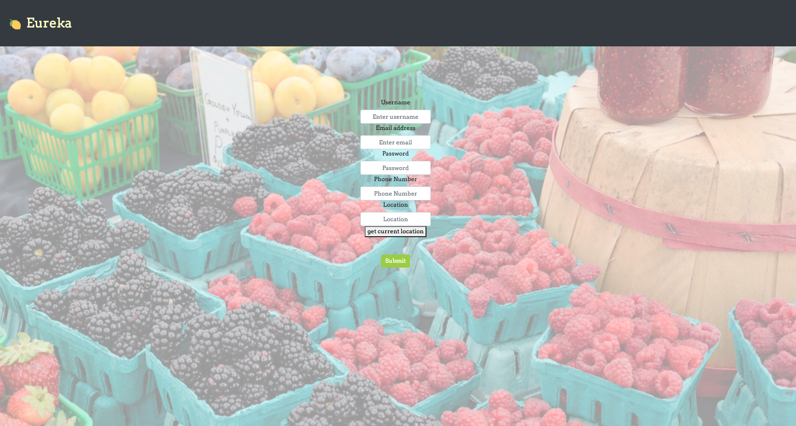
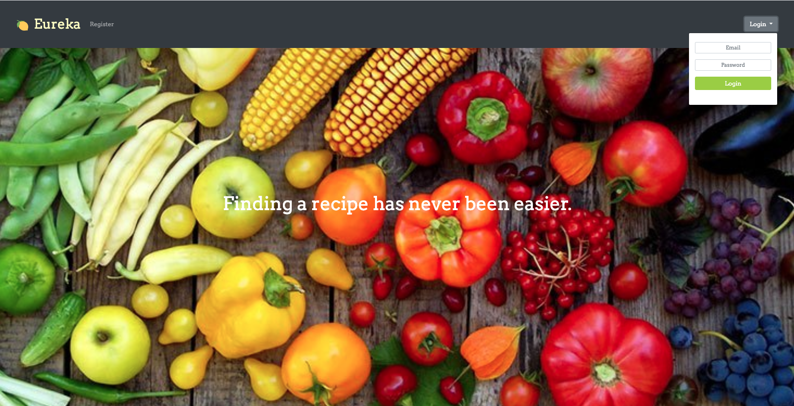
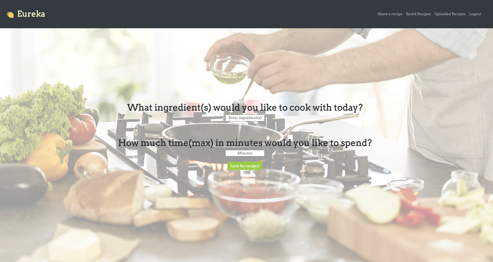
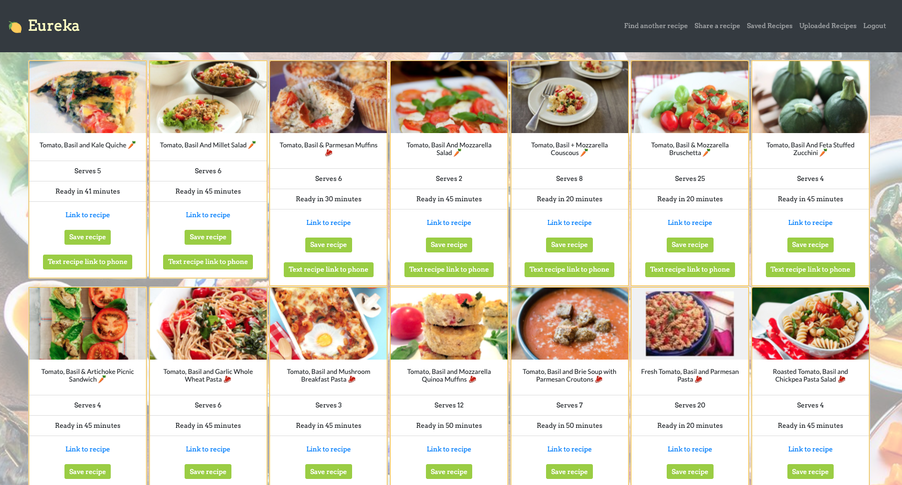
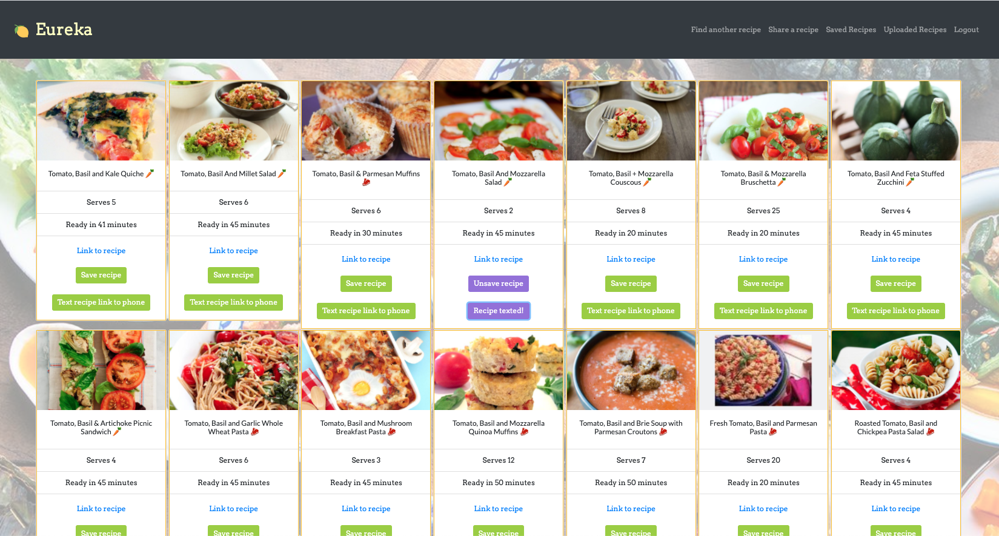
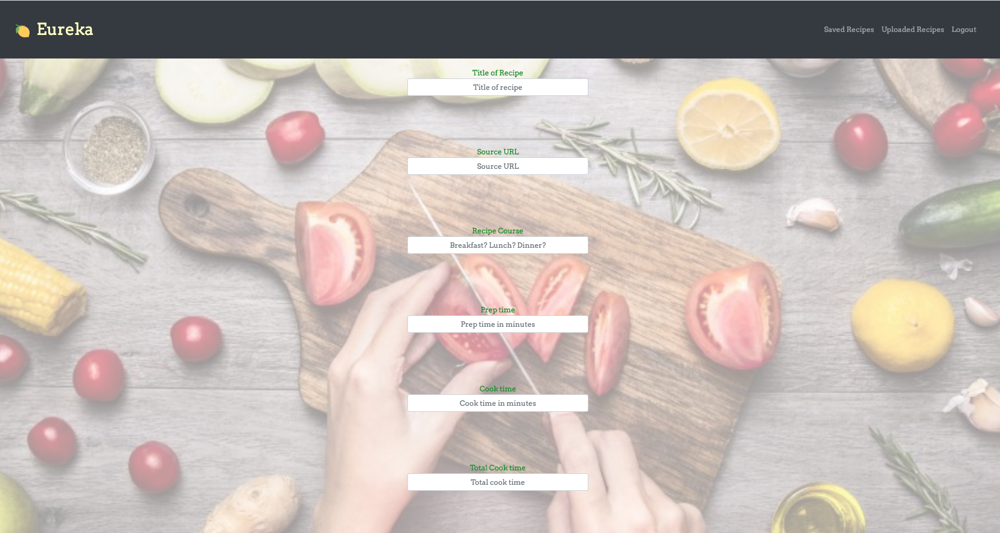

Eureka is a full stack web app built during my time at Hackbright Academy. Eureka allows a user to search for a recipe by ingredient(s) and how much time
(maximum) they want to spend. From there, the results will show, where a user can see the name of the recipe and the link to the recipe. The user can then
save the recipe or text the link of the recipe to their phone. Users can also upload their own recipe to the database.

<a href="https://www.youtube.com/watch?v=TeGDBRrVWxw"> Video Demo </a>
 
<h4>Technologies</h4>
 
<b>Tech Stack</b>: Python, JavaScript, HTML, CSS, Flask, Jinja, jQuery, PostgreSQL, SQLAlchemy, Bootstrap, Requests Library

<b> APIs </b> : Spoonacular, Twilio  

<b> Installation </b>

<i>You must have the following installed to run Eureka: </i>

API key for Spoonacular 
<br>
API key for Twilio
<br>
PostgreSQL
<br>
Python3 
<br>
Requests Library 

<b>Running Eureka on your computer:</b>

1. Clone or fork repository:

```
$ git clone https://github.com/sshantel/eureka
```

Create and activate a virtual environment inside your hb-project directory:

```
$ virtualenv env
```
```
$ source env/bin/activate
```

2. Install dependencies:
```
$ pip install -r requirements.txt
```
3. Create a secrets.sh file and add your API keys and secret keys. Example below.

 
 

4. Add variables to your virtual environment:
```
$ source secrets.sh
```

5. Create database 'recipe':
```
$ createdb recipe
```

<h4> Features </h4>

<h5> Register  </h5>



<h5> Login </h5>



<h5> Search for recipes by ingredient(s) and max cook time </h5>



<h5> Save/unsave recipe, text recipe to phone</h5>





<h5> Upload a custom recipe </h5>




 

 
